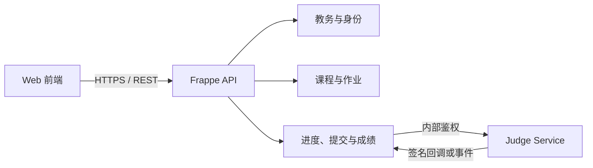

# JWLCode Frappe 业务后端

> C++ 教学平台的业务主后端与主数据中心  
> 技术基座：Frappe  
> 架构原则：Frappe 管业务与主数据，不执行不受信任代码，也不在同步请求中等待判题完成。

## 1. 仓库职责

- 管理用户、角色、学生、教师、校区、班级及其关联关系。
- 管理课程、章节、课时、编程题元数据、作业和教学资源。
- 管理学习进度、提交记录、成绩、教师反馈和统计报表。
- 向 Web 前端提供统一业务 API，完成权限、开放时间和提交频率校验。
- 调用 Judge Service 创建异步评测任务，并接收标准化结果回调。
- 提供 Frappe Desk 管理表单、工作流、审计日志和数据权限。

## 2. 系统边界



- Web 前端只访问 Frappe，不直接访问 Judge0 或 Hydro。
- Frappe 是业务主数据和最终成绩的权威来源。
- 测试数据只保存受控存储引用和版本摘要，不通过普通课程 API 返回。
- 判题引擎 ID 只作为外部映射，不作为平台业务主键。

## 3. 核心 DocType

| DocType | 建议关键字段 | 说明 |
|---|---|---|
| Campus | `name`、`code`、`status` | 多校区数据边界 |
| Student | `user_id`、`student_no`、`campus_id`、`status` | 与 User 关联，学号唯一 |
| Teacher | `user_id`、`teacher_no`、`campus_id`、`status` | 教师身份及所属校区 |
| Class | `campus_id`、`name`、`term`、`status` | 教学班 |
| Enrollment | `student_id`、`class_id`、生效区间、`status` | 学生与班级关联 |
| Teaching Assignment | `teacher_id`、`class_id`、`course_id`、`role` | 授课关系 |
| Course | `title`、`version`、`status`、`owner_id` | 支持草稿、发布和版本化 |
| Chapter | `course_id`、`title`、`sort_order` | 课程下的有序章节 |
| Lesson | `chapter_id`、`title`、`content`、`sort_order` | 学习单元 |
| Problem | `lesson_id`、`title`、`type`、`judge_policy_id`、`status` | 题目业务元数据 |
| Assignment | 目标班级、开放时间、截止时间、计分规则 | 作业发布 |
| Progress | `student_id`、`lesson_id`、`status`、`percent` | 学生与课时唯一 |
| Submission | 学生、题目、源码、语言、状态、引擎映射 | 不可变提交及评测快照 |
| Score | `submission_id`、自动分、最终分、满分、评分来源 | 区分自动与人工评分 |
| Score Adjustment | 分数变化、原因、操作者、时间 | 调分审计 |
| Judge Policy | 语言、时间、内存、编译参数、模式、引擎路由 | 评测策略 |

数据约束：使用稳定且不可复用的内部 ID；Course 和 Problem 发布后版本化；Submission 保存语言、源码、题目版本和评测策略快照；时间统一按带时区的 UTC 存储。

## 4. 对外业务 API

| 方法与路径示例 | 用途 |
|---|---|
| `GET /api/v1/me` | 当前用户、角色和数据范围 |
| `GET /api/v1/courses` | 查询有权访问的课程 |
| `GET /api/v1/lessons/{id}` | 获取课时和学习状态 |
| `GET /api/v1/problems/{id}` | 获取题面、模板和公开限制 |
| `POST /api/v1/code-runs` | 使用自定义输入试运行 |
| `POST /api/v1/submissions` | 创建正式提交并快速返回 ID |
| `GET /api/v1/submissions/{id}` | 查询标准化判题结果 |
| `GET /api/v1/students/{id}/progress` | 查看学习进度 |
| `POST /api/v1/assignments` | 教师创建作业 |
| `GET /api/v1/classes/{id}/analytics` | 班级学习与成绩分析 |

创建提交时接收题目 ID、语言、源码和 `client_request_id`，完成权限、截止时间、语言白名单及频率校验后，创建状态为 `QUEUED` 的不可变 Submission，并立即返回：

```json
{
  "submission_id": "submission_10086",
  "status": "QUEUED"
}
```

## 5. Judge Service 集成

Frappe 通过内部接口创建评测：

- `POST /internal/v1/judge-requests`
- `GET /internal/v1/judge-requests/{id}`
- `POST /internal/v1/judge-requests/{id}/cancel`
- `GET /internal/v1/engines/health`

请求包含平台提交 ID、题目版本、测试数据引用、语言、源码、资源限制、回调地址和幂等键。服务间使用短期凭据或双向 TLS。

回调处理必须验证签名和时间戳，以 `event_id` 去重，只接受合法状态迁移，并在同一事务内更新 Submission、Score 和必要的 Progress。网络超时代表结果未知，不能直接将提交标记为失败。

## 6. 权限与审计

- 学生只能访问获授权课程和本人的提交、成绩与进度。
- 教师只能访问所授班级、授权课程及相应学生数据。
- 校区管理员只能管理所属校区教务数据。
- 内容管理员管理课程题库，但默认无学生隐私权限。
- 平台管理员管理系统配置，敏感操作启用 MFA 和审计。
- Judge Service 仅能读取评测所需数据并回写指定提交。

权限必须在服务端实施，并叠加 RBAC 与校区/班级数据范围。人工调分、批量导出、学生源码查看和敏感数据访问都需要审计；日志不得记录凭据、隐藏测试数据或不必要的完整源码。

## 7. 实施顺序

1. 建立 Campus、Student、Teacher、Class、Enrollment，完成登录、角色、数据范围和批量导入。
2. 建立 Course、Chapter、Lesson、Problem 及版本机制，实现课程发布与 Progress。
3. 建立 Submission、Judge Policy、Score，打通 Judge Service 请求与幂等回调。
4. 增加 Assignment、调分、教师反馈、班级看板和成绩分析。
5. 完善多校区、报表、审计、备份恢复和隐私合规。

## 8. 非功能要求

- 提交创建快速返回，判题异步完成。
- 提交、回调与成绩更新保持幂等和可追溯。
- Web 进程、后台 Worker 和 Scheduler 可独立扩容。
- 建立健康检查、结构化日志、统一错误码、数据库备份及恢复演练。
- 使用贯穿各服务的 `trace_id` 与 `submission_id` 定位问题。

## 9. 当前实现

仓库已经包含可安装的 `jwlcode` Frappe app：

- 17 个教务、课程、学习、判题和调分审计 DocType。
- 学生、教师、校区管理员、内容管理员和 Judge Service 角色初始化。
- 当前用户、课程、课时、题目、试运行、正式提交、提交查询、学习进度、作业、班级分析和人工调分 API。
- Submission 不可变快照、学生内幂等键、提交频率限制和异步 Judge Service 派发。
- HMAC-SHA256 回调验签、五分钟防重放窗口、事件去重、行锁、状态版本与合法状态迁移。
- RBAC 叠加班级/校区数据范围；源码和测试数据引用使用高权限字段隔离。

安装、配置、调用示例和接口映射见 [docs/API.md](docs/API.md)。

通用主数据维护继续使用 Frappe 自带的 Desk 和 `/api/resource/{DocType}`，本项目没有重复实现通用 CRUD。
