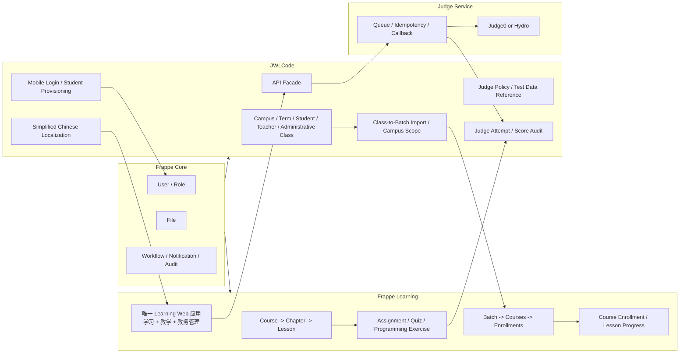
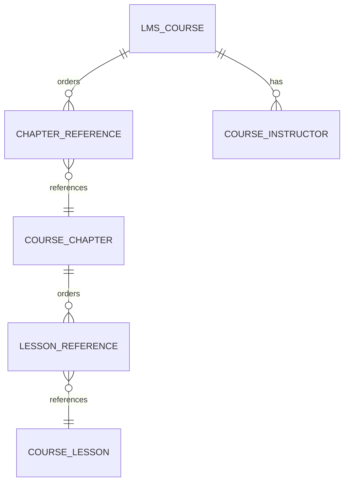
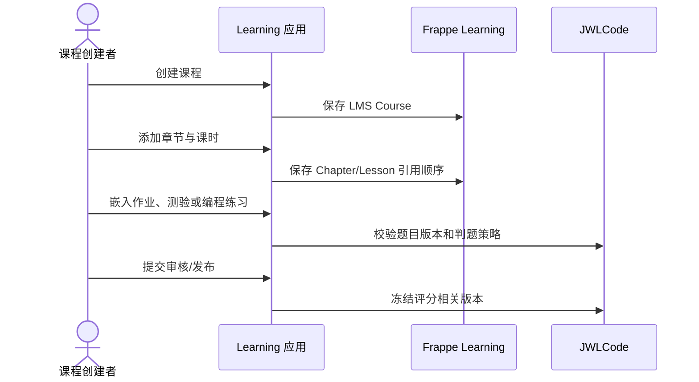
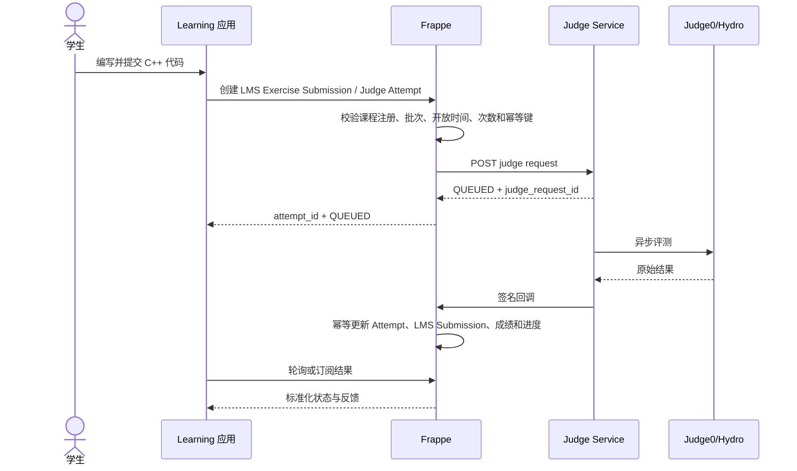

# Edu Code 教学系统设计

> 状态：评审稿，不作为已实施功能  
> 版本：2.1-draft  
> 日期：2026-08-31  
> 参考基线：Frappe Learning `develop`，commit `13d2114dac424fca0fed6c7516bd6f9773e55b1b`

## 1. 设计结论

本系统不再自行重复实现完整 LMS。推荐采用以下组合：

- **Frappe Framework**：用户、角色、文件、权限、工作流、通知、导入导出和审计基础。
- **Frappe Learning（官方 `frappe/lms`）**：唯一的业务与管理界面，以及课程、章节、课时、教学批次、课程注册、学习进度、作业、测验和编程练习。
- **JWLCode**：作为 Learning 的扩展应用，为同一个界面增加学生管理、学校教务、多校区数据范围、手机号认证、C++ 异步判题和中文本地化。
- **Judge Service**：Judge0/Hydro 的异步评测编排、幂等、状态归一化和签名回调。

核心原则是：

1. 课程内容与实际授课分离。
2. 行政班与教学批次分离。
3. 教学批次入学与课程注册分离，但由系统自动联动。
4. 课时是混合内容容器，作业、测验和编程练习是可嵌入、可复用的活动。
5. 学习进度属于“用户 + 课程注册 + 课时”，不能只按“学生 + 课时”记录。
6. JWLCode 不复制 Frappe Learning 已经成熟的课程、批次和门户功能。
7. 教师、教务、学生均使用同一个 Learning 应用，按角色显示不同菜单和操作。
8. Frappe Desk 仅供 System Manager 做底层维护，不作为第二个教学管理后台。
9. 首期登录采用 Frappe 原生“手机号或邮箱 + 密码”，不重复实现密码认证。
10. 所有启用功能必须完成简体中文翻译，不允许面向用户的英文界面残留。

## 2. 当前模型存在的问题

现有 JWLCode 模型能够保存基础数据，但尚未形成正确的教学闭环。

### 2.1 行政班被当作授课容器

现有 `JWL Assignment` 直接关联 `JWL Academic Class + JWL Course`，`JWL Teaching Assignment` 也直接组合教师、行政班和课程。

问题：

- 一个行政班可能同时学习多门课程。
- 一门课程可能由多个行政班合班授课。
- 学生可能参加选修班、竞赛班或短期训练营，与行政班不同。
- 同一门课程在不同学期、教师和校区需要不同的开放时间、课表和考核安排。

因此，行政班只能作为教务组织和批量选人来源，不能直接承担课程授权和教学活动。

### 2.2 课程内容与授课实例混合

当前 `JWL Course` 没有教学批次、课程注册、课程讲师列表、课程发布策略和学习顺序控制。

正确关系应为：

```text
课程内容模板 -> 被一个或多个教学批次采用 -> 学员加入批次 -> 自动获得课程注册
```

课程可以跨学期复用；教学批次才包含日期、时间、学员、教师、课表和考核。

### 2.3 课件只是一个 Text Editor 字段

Frappe Learning 将 Lesson 作为主要学习内容容器，可混排：

- 文本、标题和代码片段
- 图片、PDF、音频和视频
- YouTube、Vimeo、Google Docs/Slides
- 作业
- 测验
- 编程练习
- SCORM 内容
- 教师专用备注

现有 `JWL Lesson.content` 无法表达可排序内容块、活动门槛、预览内容和教师备注。

### 2.4 编程题被固定绑定到单个课时

当前 `JWL Problem.lesson` 为必填，导致题目不能：

- 在多个课时中复用；
- 同时作为课程练习和批次考核；
- 在不同教学批次设置不同截止时间、次数和分值；
- 独立维护题库和版本。

编程练习定义应独立存在，通过课时内容块或批次考核引用。

### 2.5 进度缺少课程注册上下文

当前 `JWL Progress` 只使用 `student + lesson`。

如果同一学生通过不同批次学习同一课程，或课程发布了新版本，就无法区分进度属于哪一次学习。正确粒度应为：

```text
member + course_enrollment + course + chapter + lesson
```

### 2.6 多个后台会割裂业务流程

此前设计仍保留 Learning Portal、Edu Code Workspace 和 Frappe Desk 三个入口，这不符合本项目要求。

正式产品只提供一个 Learning 应用。学生、教师、教务管理员登录后进入相同的应用外壳，根据角色看到学习、教学或管理菜单。学生档案、行政班和批量导入也必须扩展到 Learning 内部，不能要求业务人员再进入 Desk。

Frappe Desk 可以保留给极少数 System Manager，用于数据库迁移、系统设置和故障处理，但不出现在日常业务导航中。

## 3. 领域术语

| 中文名称 | 推荐实体 | 定义 |
|---|---|---|
| 行政班 | `JWL Academic Class` | 学校组织关系，用于学籍、校区和批量选人，不直接授予课程权限 |
| 课程 | `LMS Course` | 可复用的课程内容与目录 |
| 章节 | `Course Chapter` | 课程下的有序内容分组 |
| 课时/课件 | `Course Lesson` | 学习内容容器，可混排媒体和教学活动 |
| 教学批次 | `LMS Batch` | 一次真实授课实例，包含时间、课程、教师、学员和考核 |
| 批次入学 | `LMS Batch Enrollment` | 用户加入某个教学批次 |
| 课程注册 | `LMS Enrollment` | 用户获得某门课程的学习权限与汇总进度 |
| 课时进度 | `LMS Course Progress` | 用户对某课时的完成状态 |
| 作业 | `LMS Assignment` | 文件、图片、URL 或文本形式的人工评阅活动 |
| 测验 | `LMS Quiz` | 选择、填空、开放题等测验 |
| 编程练习 | `LMS Programming Exercise` | 可嵌入课时或批次考核的编程活动 |
| 代码提交 | `LMS Programming Exercise Submission` | 学生提交的代码及教学侧结果 |
| 判题尝试 | `JWL Judge Attempt` | JWLCode 扩展的异步评测状态、引擎映射和资源用量 |

“班级”在产品界面中必须明确显示为“行政班”或“教学批次”，禁止只显示模糊的“班级”。

## 4. 总体边界



## 5. 直接复用 Frappe Learning 的模型

以下功能不在 JWLCode 中重新创建同义 DocType。

### 5.1 课程内容

直接使用：

- `LMS Course`
- `Chapter Reference`
- `Course Chapter`
- `Lesson Reference`
- `Course Lesson`
- `Course Instructor`

关系：



采用引用子表而不是只靠 `sort_order`，可以支持门户中的拖拽排序，同时保持 Chapter 和 Lesson 是拥有稳定 ID 的独立文档。

### 5.2 教学批次与注册

直接使用：

- `LMS Batch`
- `Batch Course`
- `LMS Batch Enrollment`
- `LMS Enrollment`
- `LMS Course Progress`
- `LMS Batch Timetable`
- `LMS Live Class`（需要直播课时启用）

联动规则：

1. 管理员或教师创建教学批次。
2. 批次选择一门或多门课程。
3. 学员加入 `LMS Batch Enrollment`。
4. 系统为批次内每门课程创建唯一的 `LMS Enrollment`。
5. 学员完成课时后写入 `LMS Course Progress`。
6. 系统重新计算 `LMS Enrollment.progress` 和 `current_lesson`。

这一行为与 Frappe Learning 当前控制器保持一致，不在 JWLCode 中再次实现一套 Enrollment。

### 5.3 通用教学活动

直接使用：

- `LMS Assignment` 与 `LMS Assignment Submission`
- `LMS Quiz`、`LMS Question` 与 `LMS Quiz Submission`
- `LMS Assessment`，用于将活动加入教学批次

作业适用于文档、PDF、图片、URL 和文本提交；测验适用于客观题与开放题。C++ 编程活动使用下一节的扩展方案。

## 6. JWLCode 保留和新增的模型

### 6.1 学校教务主数据

| DocType | 处理 | 核心字段 |
|---|---|---|
| `JWL Campus` | 保留 | `campus_name`、`code`、`status` |
| `JWL Academic Term` | 新增 | `term_name`、`start_date`、`end_date`、`status` |
| `JWL Student` | 保留 | `user`、`student_no`、`campus`、`status` |
| `JWL Teacher` | 保留 | `user`、`teacher_no`、`campus`、`status` |
| `JWL Academic Class` | 保留但定义为行政班 | `class_name`、`campus`、`academic_term`、`status` |
| `JWL Class Membership` | 由现 Enrollment 重命名/迁移 | `student`、`academic_class`、`start_date`、`end_date`、`status` |

身份仍以 Frappe `User` 为权威来源。Student 和 Teacher 只是学校业务资料，不另建登录账号体系。

### 6.2 行政班到教学批次的桥接

不复制 `LMS Batch`。在 LMS Batch 上增加 JWLCode 自定义字段：

| 字段 | 类型 | 用途 |
|---|---|---|
| `jwl_campus` | Link / JWL Campus | 多校区数据范围 |
| `jwl_academic_term` | Link / JWL Academic Term | 所属学期 |
| `jwl_source_class` | Link / JWL Academic Class | 可选的学员来源行政班 |
| `jwl_sync_mode` | Select | Manual / Add Only / Mirror |
| `jwl_course_version_policy` | Select | Fixed / Latest Published |

默认使用 **Add Only**：从行政班导入学生后，后续只补充新成员，不自动删除已经产生学习记录的成员。

Mirror 模式只允许在批次尚未开始且没有提交记录时使用，避免行政班调整造成历史学习数据丢失。

### 6.3 C++ 编程练习扩展

优先扩展 `LMS Programming Exercise`，复用其门户页面、课时内容块、批次考核和提交列表。

需要增加：

| 扩展字段/实体 | 用途 |
|---|---|
| `jwl_language` | 首期固定 `cpp17`，未来扩展 `cpp20` |
| `jwl_version` | 发布版本 |
| `jwl_status` | Draft / Review / Published / Archived |
| `jwl_judge_policy` | 关联 JWL Judge Policy |
| `jwl_test_case_ref` | 受控测试数据引用 |
| `jwl_test_case_checksum` | 测试数据校验摘要 |
| `jwl_starter_code` | 学生初始代码 |
| `jwl_solution_notes` | 教师专用题解，不进入学生 API |
| `jwl_max_score` | 满分 |

Frappe Learning 原始 `LMS Test Case` 适合简单示例，但隐藏正式测试数据不得通过普通 DocType API 下发。正式测试数据继续使用受控存储引用。

### 6.4 异步判题模型

保留 Frappe Learning 的 `LMS Programming Exercise Submission` 作为教学提交记录，并增加一对多的评测尝试：

#### JWL Judge Attempt

| 字段 | 说明 |
|---|---|
| `exercise_submission` | Link / LMS Programming Exercise Submission |
| `attempt_no` | 同一教学提交下的评测序号 |
| `submission_type` | Run / Submission |
| `client_request_id` | 客户端幂等键 |
| `trace_id` | 全链路追踪 ID |
| `status` | QUEUED、COMPILING、RUNNING 及标准终态 |
| `status_version` | 防止乱序回调 |
| `judge_request_id` | Judge Service 请求号 |
| `language` | cpp17 等 |
| `source_code` | 本次代码快照 |
| `custom_input/output` | 仅 Run 使用 |
| `exercise_version` | 题目版本快照 |
| `policy_snapshot` | 评测策略快照 |
| `test_case_ref/checksum` | 测试数据版本快照 |
| `score/max_score` | 自动评分 |
| `time_ms/memory_kb` | 资源用量 |
| `compiler_message` | 编译信息 |
| `finished_at` | 完成时间 |

约束：

- `exercise_submission + attempt_no` 唯一。
- `member + client_request_id` 唯一。
- 终态不可回退。
- Run 不计入正式成绩。
- 正式 Submission 完成后回写 LMS 提交的 Passed/Failed 和扩展分数。

继续保留：

- `JWL Judge Policy`
- `JWL Judge Callback Event`
- `JWL Score Adjustment`

现有 `JWL Submission` 的数据将迁移到 `LMS Programming Exercise Submission + JWL Judge Attempt`，迁移完成前只读保留。

### 6.5 Learning 内的学生管理

Frappe Learning 已有 Members 列表、角色筛选、新增成员和成员编辑页面。本项目直接扩展这些页面，不新建学生管理后台。

成员列表增加：

- 姓名、手机号、学号、校区、行政班和账号状态；
- 按姓名、手机号、学号搜索；
- 按校区、行政班、角色和启用状态筛选；
- 单个新增、批量导入、批量加入行政班和教学批次；
- 启用、停用、重置密码和发送激活通知；
- 查看学生课程注册、批次、进度、作业和编程提交摘要。

新增学生不再直接调用通用 `frappe.client.insert`，而是使用一个事务化业务接口：

1. 规范化并校验手机号；
2. 创建或关联 Frappe User；
3. 创建 JWL Student；
4. 分配 LMS Student 角色；
5. 建立行政班成员关系；
6. 可选加入教学批次；
7. 生成激活凭据并发送通知；
8. 任一步失败则整体回滚。

Frappe User 当前要求 Email。没有真实邮箱的学生使用系统管理的内部身份邮箱，例如 `stu-<student_no>@identity.invalid`，该地址不可用于外发邮件，并在 Learning 界面隐藏。手机号才是学生的主要登录标识。

### 6.6 手机号登录

首期使用 Frappe 16 原生的“手机号或邮箱 + 密码”认证：

- 开启 System Settings 的 `allow_login_using_mobile_number`；
- 使用 `User.mobile_no`，该字段具有唯一约束；
- 登录仍调用 Frappe 标准 `/api/method/login`；
- 保留标准登录失败计数、账号停用、会话和双因素认证能力；
- 登录页统一显示“手机号或邮箱”和“密码”；
- 学生管理接口写入手机号前统一规范化，避免 `138...`、`+86 138...` 被当成不同号码。

中国大陆手机号统一保存为 E.164 格式 `+86XXXXXXXXXXX`，界面可按本地格式展示。其他国家/地区必须同时保存国家区号。

短信验证码登录不在首期重复开发。若后续确认需要免密登录，再增加独立的 SMS Challenge，必须具备验证码哈希、有效期、单次使用、IP/手机号限流、错误次数上限、防枚举响应和短信供应商适配层。

### 6.7 简体中文本地化

Learning 的 `zh.po` 在参考版本中约有 1905 个消息条目，其中约 530 个空翻译；仅设置 `zh_CN` 不能实现完整汉化。

采用“上游 Learning + 薄中文补丁分支”的方式维护：

1. 站点默认语言和新用户语言设为 `zh_CN`。
2. 补齐 Learning `zh.po` 中所有启用功能的空翻译。
3. 扫描 Vue、TypeScript 和 Python 中未使用 `__()` 包裹的可见英文字符串并修正。
4. JWLCode 新增字符串全部进入自身中文翻译目录。
5. 固定术语表，避免同一个词在不同页面出现多种译法。
6. 可贡献的翻译修复提交到 Frappe Learning 上游；本地只保留尚未合并的最小补丁。

首期术语：

| 英文 | 中文 |
|---|---|
| Learning | 教学平台 |
| Course | 课程 |
| Chapter | 章节 |
| Lesson | 课时 |
| Batch | 教学批次 |
| Member | 成员 |
| Student | 学生 |
| Instructor | 教师 |
| Evaluator | 评阅教师 |
| Enrollment | 课程注册 |
| Assignment | 作业 |
| Quiz | 测验 |
| Programming Exercise | 编程练习 |
| Submission | 提交 |

汉化验收按页面而不是翻译文件完成率判断：所有启用路由、弹窗、校验提示、空状态、邮件和移动端导航不得出现未批准的英文。C++、API、编译器名称和用户自行录入的英文内容不计为缺陷。

## 7. 课程版本策略

Frappe Learning 原生课程偏向持续编辑；学校教学和成绩追溯需要更严格的发布策略。

推荐：

1. `LMS Course` 增加 `jwl_course_code`、`jwl_version`、`jwl_based_on`。
2. `course_code + version` 唯一。
3. Draft 可编辑。
4. Published 后，影响目录、题目和计分的字段禁止原地修改。
5. 修改已发布课程时执行“复制为新版本”。
6. `Batch Course` 始终链接确定的课程版本，不自动漂移。
7. 已产生提交的编程练习版本不可删除。

课程描述、封面等非评分信息可在审计后允许修订；目录顺序、练习版本、满分和测试数据必须版本化。

## 8. 关键业务流程

### 8.1 创建课程



### 8.2 创建教学批次

1. 选择校区、学期、起止日期和时区。
2. 选择一个或多个已发布课程版本。
3. 添加教师/评阅人。
4. 可选择来源行政班。
5. 导入学生，创建 `LMS Batch Enrollment`。
6. Frappe Learning 自动创建对应 `LMS Enrollment`。
7. 设置课表、直播课和批次考核。
8. 发布批次并通知学员。

### 8.3 学习与进度

1. 学员从 Learning 应用进入“我的批次”或“我的课程”。
2. 系统校验批次入学或课程注册。
3. 学员按课程目录打开 Lesson。
4. 私有文件通过与课时权限一致的服务端检查。
5. 若开启顺序学习，未完成前置课时则后续课时锁定。
6. 必做测验、作业或编程练习未通过时，课时不能标记完成。
7. 完成后写入 `LMS Course Progress` 并重算课程注册进度。

### 8.4 C++ 提交



## 9. 权限模型

### 9.1 角色

| 角色 | 来源 | 权限 |
|---|---|---|
| System Manager | Frappe | 系统配置和应用管理 |
| Moderator | Frappe Learning | 全局课程、批次和用户运营 |
| Course Creator | Frappe Learning | 创建和维护获授权课程 |
| Batch Evaluator | Frappe Learning | 管理获授权批次、评阅提交 |
| LMS Student | Frappe Learning | 学习已注册课程、提交本人活动 |
| JWL Campus Manager | JWLCode | 管理所属校区教务和批次范围 |
| JWL Judge Service | JWLCode | 仅调用判题回调和内部评测接口 |

不再创建与以上含义重复的“JWL Teacher/Student 权限角色”。Teacher、Student DocType 是业务资料；门户权限由 Learning 角色和具体课程/批次关系决定。

### 9.2 数据范围

权限判断顺序：

1. 系统角色；
2. 校区 User Permission；
3. 是否为课程讲师；
4. 是否为批次教师/评阅人；
5. 是否拥有有效 Batch Enrollment 或 Course Enrollment；
6. 资源是否公开预览；
7. 是否为记录本人。

私有课件文件、教师备注、隐藏测试数据、源码、人工调分和批量导出必须单独检查，不能只依赖前端隐藏。

## 10. 单一 Learning 应用设计

### 10.1 唯一入口

所有业务角色登录后都进入同一个 Learning Web 应用。产品导航、表单、列表、弹窗和移动端页面使用 Learning 现有 Vue/Frappe UI 设计体系，不再建设第二套管理端。

建议导航按权限动态组合：

- 学生：首页、我的课程、我的教学批次、作业、编程练习、成绩。
- 教师：课程、教学批次、作业、测验、编程练习、提交与评阅、统计。
- 教务管理员：学生管理、教师管理、校区、学期、行政班、教学批次、课程审核、批量导入。
- 系统管理员：在以上菜单中额外显示平台设置、判题策略、翻译检查和系统状态。

同一用户拥有多个角色时仍使用同一界面，通过菜单权限和页面操作权限合并能力，不跳转到其他后台。

### 10.2 管理功能扩展位置

- 学生和教师管理扩展现有 Learning Members 页面。
- 校区、学期和行政班加入 Learning Settings 的“教务管理”分组。
- 行政班成员和批次成员使用统一成员选择器和批量导入组件。
- 判题策略和引擎状态加入 Learning Settings 的“编程判题”分组。
- 调分和回调事件作为教师提交页面及系统状态页的下钻内容。
- 课程创建继续使用 Learning 的课程设置、章节拖拽和 Lesson 编辑器。

### 10.3 Frappe Desk 的处理

- `Edu Code` Workspace 从业务导航和应用启动器移除。
- 普通学生、教师和教务人员不授予 Desk 使用权限。
- Desk 仅保留给 System Manager 做底层维护、迁移和故障处理。
- 任何日常教学或教务流程不得要求用户进入 Desk 才能完成。

### 10.4 首期功能开关

启用：课程、教学批次、成员、作业、测验、编程练习、提交、进度、统计和设置。

暂时隐藏：付费、优惠券、求职、证书评估、Zoom/Google Meet 等未确认功能。隐藏功能不出现在菜单、搜索和命令面板中，避免无关英文页面和维护成本；后续启用前必须先完成中文化与权限验收。

## 11. API 边界

前端优先使用 Frappe Learning 已有的门户资源和 API；JWLCode 只提供缺失的聚合与判题接口。

### 11.1 复用

- 课程列表、课程详情和目录
- 批次列表、详情和成员
- Course/Batch Enrollment
- Lesson 获取与进度保存
- Assignment、Quiz 和基础 Programming Exercise

### 11.2 JWLCode 扩展

- 当前用户的校区与学校身份
- Learning 学生创建、编辑、批量导入和停用
- 手机号规范化、激活和密码重置辅助流程
- 行政班导入教学批次
- C++ Run/Submission
- 异步判题状态
- 班级/批次编程学习分析
- 隐藏测试数据和 Judge Service 内部契约
- 人工调分审计

API 返回必须使用教学批次和课程注册作为访问上下文，不能继续只凭 `academic_class` 判断课程权限。

现有 JWLCode 12 个业务 API 均标记为 **Provisional**，在新模型评审通过后重新设计；前端不应继续扩大对旧参数的依赖。

## 12. 现有 DocType 迁移建议

| 现有 DocType | 目标 | 处理 |
|---|---|---|
| JWL Campus | JWL Campus | 保留 |
| JWL Student | JWL Student + User | 保留资料，身份以 User 为准 |
| JWL Teacher | JWL Teacher + User | 保留资料，课程讲师使用 User |
| JWL Academic Class | JWL Academic Class | 保留并明确为行政班 |
| JWL Enrollment | JWL Class Membership | 重命名/迁移，禁止承担课程注册 |
| JWL Teaching Assignment | LMS Batch instructors / Course Instructor | 迁移后废弃 |
| JWL Course | LMS Course | 元数据与版本迁移 |
| JWL Chapter | Course Chapter | 迁移并生成 Chapter Reference |
| JWL Lesson | Course Lesson | 迁移内容并生成 Lesson Reference |
| JWL Problem | LMS Programming Exercise + JWL 扩展字段 | 解除 Lesson 必填关系 |
| JWL Assignment | LMS Assignment + LMS Assessment | 按类型和批次上下文迁移 |
| JWL Progress | LMS Course Progress | 增加课程注册上下文后迁移 |
| JWL Submission | LMS Programming Exercise Submission + JWL Judge Attempt | 拆分教学提交与评测尝试 |
| JWL Score | LMS 提交分数扩展 | 合并，避免双份最终分 |
| JWL Score Adjustment | JWL Score Adjustment | 保留审计 |
| JWL Judge Policy | JWL Judge Policy | 保留 |
| JWL Judge Callback Event | JWL Judge Callback Event | 保留 |

迁移要求：

- 迁移前冻结旧模型写入。
- 先安装与验证 Frappe Learning，再导入数据。
- 所有迁移脚本可重复运行，并输出成功、跳过和失败清单。
- 新旧记录保存映射表。
- 先双读校验，不进行双写。
- 完成数量、权限、进度和成绩对账后再切换 API。
- 旧表至少保留一个发布周期为只读，最后再决定删除。

## 13. 不重复建设清单

以下能力必须优先复用，不在 JWLCode 重新开发：

- 登录、用户、角色、文件和附件
- Frappe 原生手机号加密码认证、会话和登录限流
- 课程、章节、课时目录
- Lesson 富内容编辑器
- 课程讲师和课程注册
- 教学批次、批次成员和课表
- 作业、测验、通用编程练习界面
- Learning 的学生、教师和管理者视图
- Learning Members 成员管理页面和组件
- 课程进度聚合
- 通知、邮件、数据导入和后台审计

JWLCode 只实现官方 Learning 不具备或不满足本项目要求的部分。

## 14. 实施阶段

### 阶段 A：技术验证

- 将与当前 Frappe 16 兼容的 Frappe Learning 作为正式依赖安装到独立测试站点。
- 验证课程、批次、入学、Lesson 编辑器和编程练习。
- 验证 AGPL-3.0 合规要求。
- 验证 JWLCode 自定义字段、hooks 和 Learning 前端扩展方式。
- 建立 Learning 薄补丁分支和上游同步流程。

出口：单一 Learning 应用可以运行，扩展方式和版本基线固定。

### 阶段 B：中文化与统一界面

- 设置站点和用户默认语言为 `zh_CN`。
- 补齐启用功能的中文 PO 翻译。
- 修复未接入 `__()` 的可见英文字符串。
- 隐藏未启用功能和原 Edu Code Workspace。
- 完成桌面端、移动端和邮件中文验收矩阵。

出口：所有业务角色只使用一个中文 Learning 应用。

### 阶段 C：学生管理与手机号登录

- 扩展 Members 页面和 MemberForm。
- 增加手机号、学号、校区、行政班、状态和批量导入。
- 开启 Frappe 原生手机号登录并实施 E.164 规范化。
- 实现事务化学生创建、激活、停用和密码重置辅助流程。
- 完成手机号重复、账号枚举、爆破和权限测试。

出口：教务管理员在 Learning 内管理学生，学生可用手机号和密码登录。

### 阶段 D：教务桥接

- 增加 Academic Term 和 Class Membership。
- 为 LMS Batch 增加校区、学期、来源行政班字段。
- 实现行政班成员导入 Batch Enrollment。
- 增加校区数据权限。

出口：管理员能从行政班创建教学批次，学生正确获得课程注册。

### 阶段 E：课程与教学

- 使用 Learning 创建课程、章节和 Lesson。
- 迁移旧课程内容。
- 设置课程发布/版本策略。
- 在同一 Learning 界面管理课程、批次和成员。

出口：教师在 Learning 建课，学生在 Learning 学习并记录进度。

### 阶段 F：C++ 判题

- 扩展 LMS Programming Exercise。
- 实现 JWL Judge Attempt 和 Judge Service 联动。
- 打通 Run、Submission、回调、成绩和进度门槛。
- 完成隐藏测试数据、限流和权限测试。

出口：C++ 学习—提交—判题—成绩闭环。

### 阶段 G：迁移与切换

- 迁移旧 DocType 数据。
- 重写并导出 API 契约。
- 前端切换到课程注册和教学批次上下文。
- 对账后冻结旧接口。

## 15. 已确认约束与待确认项

已经确认：

1. Frappe Learning 是教学系统基底和唯一业务界面。
2. 不建设独立 Edu Code 管理后台。
3. 学生管理扩展在 Learning 内。
4. 支持手机号登录。
5. 增加 C++ 判题能力。
6. 所有启用界面必须完成简体中文化。

实施前仍需确认：

1. 手机号登录首期是否采用推荐的“手机号 + 密码”，还是必须同时上线短信验证码免密登录。
2. 无真实邮箱学生使用的内部身份邮箱域名。
3. 短信供应商、短信签名和密码重置流程。
4. 行政班是否承担固定课表，还是只作为教务组织和批量选人来源。
5. 一个教学批次是否允许包含多门课程。推荐允许，与 Learning 一致。
6. 课程发布后是否强制不可变并通过复制生成新版本。推荐强制。
7. 首期是否只支持 C++17。推荐是。
8. Frappe Learning 的 AGPL-3.0 是否符合项目的部署和分发政策。

## 16. 验收标准

设计落地后的最小闭环：

1. 学生、教师和管理员均从同一个 Learning 应用完成业务，不需要进入其他后台。
2. 教务管理员在 Learning 内创建、导入、查询、停用学生，并维护学号、手机号、校区和行政班。
3. 学生可以使用唯一、规范化的手机号和密码登录。
4. Learning 所有启用页面、弹窗、提示、邮件和移动端导航均为简体中文。
5. 管理员创建校区、学期和行政班。
6. 教师在 Learning 创建并发布课程。
7. 课程包含章节、富内容 Lesson 和 C++ 编程练习。
8. 管理员创建教学批次并采用确定的课程版本。
9. 从行政班导入学员后，系统自动创建批次入学和课程注册。
10. 学生只能访问已注册课程和允许预览的内容。
11. 学生完成 Lesson，进度正确聚合到课程注册。
12. 学生提交 C++ 后异步返回标准化判题结果。
13. 教师在批次中查看进度、提交和成绩。
14. 历史提交能追溯课程版本、题目版本、策略和测试数据版本。

## 17. 参考资料

- [Frappe Learning GitHub](https://github.com/frappe/lms)
- [Frappe Learning：Introduction](https://docs.frappe.io/learning/introduction)
- [Frappe Learning：Create a Course](https://docs.frappe.io/learning/create-a-course)
- [Frappe Learning：Add a Lesson](https://docs.frappe.io/learning/course-creation/adding-a-lesson/adding-simple-content)
- [Frappe Learning：Create a Batch](https://docs.frappe.io/learning/create-a-batch)
- [Frappe Learning：Assignments](https://docs.frappe.io/learning/assignments)
- [Frappe Learning：Quizzes](https://docs.frappe.io/learning/quizzes)
- [Frappe 16 User 手机号认证实现](https://github.com/frappe/frappe/blob/version-16/frappe/core/doctype/user/user.py)
- [Frappe Learning 源码基线](https://github.com/frappe/lms/tree/13d2114dac424fca0fed6c7516bd6f9773e55b1b)

本设计借鉴 Frappe Learning 的领域模型和流程，但不复制其源码。若安装、修改或分发 Frappe Learning，必须遵守其 AGPL-3.0 许可证。
